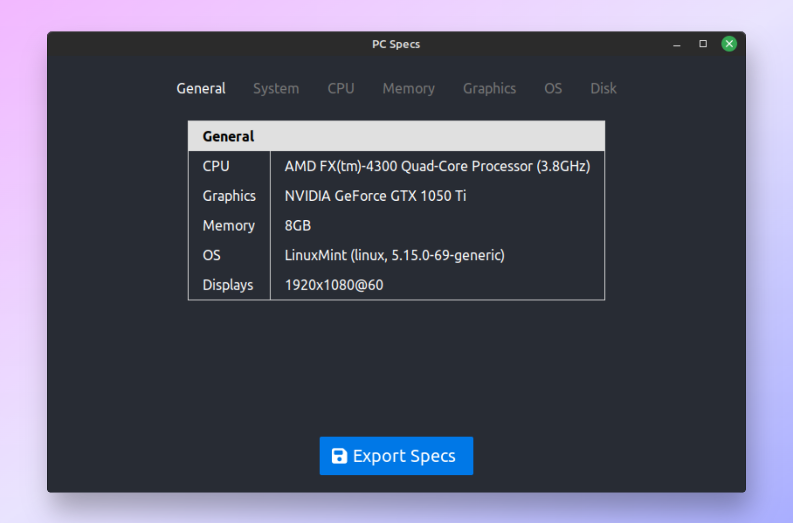

# PC Specs



App to show your PC specs.

Made to test [Neutralinojs](https://neutralino.js.org/) and [SolidJS](https://www.solidjs.com/).

## Usage

Download the [latest release](https://github.com/piotrpdev/pc-specs/releases/) for your system and run the executable.

## Development

```bash
# Install dependencies in root, my-app, and extensions
npm i
cd my-app
npm i
cd ../extensions/hardware
npm i

# Add client library (neutralino.js)
cd ../..
neu update

# Build the frontend
cd my-app
npm run build

# Bundle the extension using esbuild and package into binaries
cd ../extensions/hardware
npm run bundle
npm run package

# Build the app
cd ../..
npm run release
```